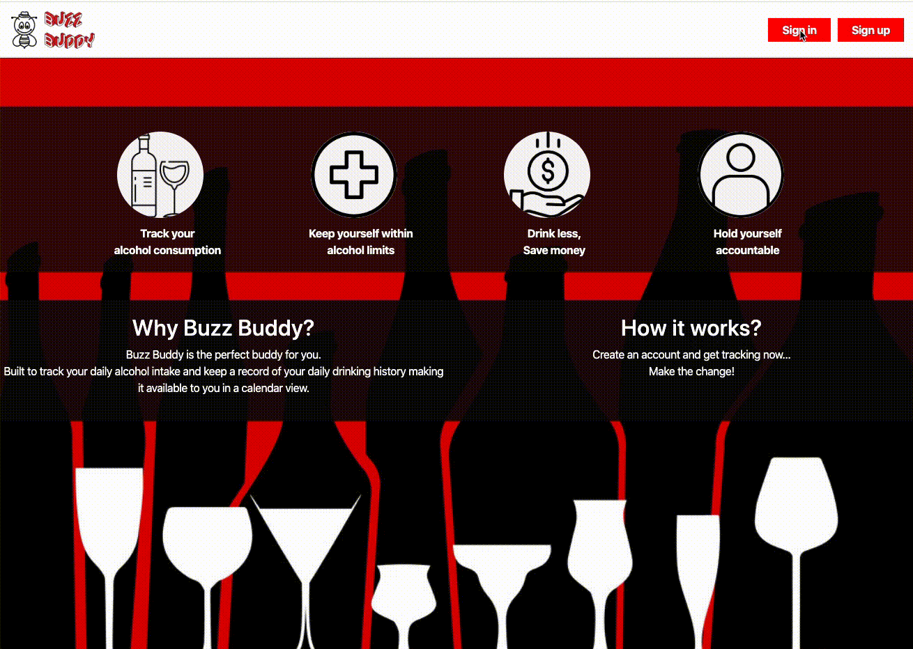
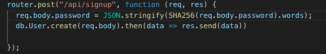
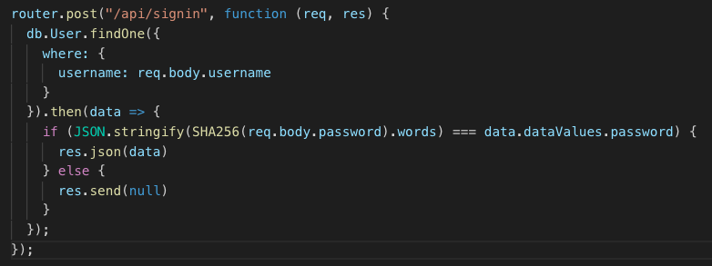
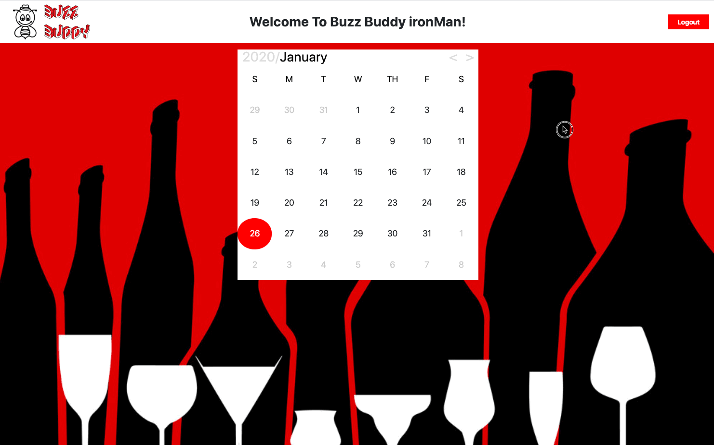
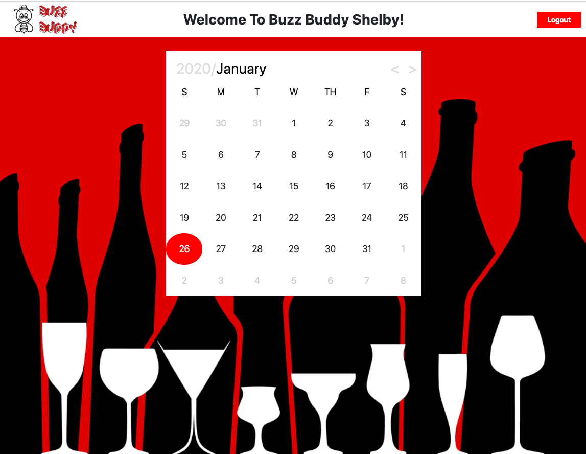

#  Buzz Buddy 

https://polar-eyrie-33440.herokuapp.com/

**Default login**

username: `demo`
password: `asd`

## **Description**

 Buzz Buddy is an application that tracks users daily alcohol intake. Each user has a personal account. The users profile consists of a calendar in which they will select a date to add in alcohol.  The alcohol, along with quantity and price is selected from a modal and then pushed into a card for that date. 

## **Installation**

1. Clone GitHub Repository
2. Install node packages

        cd project2
        npm install
        
3. Update `password` in config.json file
4. Create database in MySQL

        cd project2/db
        mysql -u root -p
        source schema.sql

5. Populate table in MySQL

        cd project2/db
        mysql -u root -p
        source seeds.sql

## **Live Demo**

## **Features**

### Local Storage

Allows for the key-value pair to be saved in the web browser. These can then be accessed at any time unless intentionally deleted. 

First, storing the user data object  and alcohol object and accessing the userId, alcoholId and alcoholType to insert data into the alcoholUsers table (join table).

        localStorage.setItem("currentUser", JSON.stringify(data));
        localStorage.setItem("alcoholid",alcoholId;

The, accessing the username to display the username
on successful sign in.

        var alcoholid = localStorage.getItem("alcoholid")

Finally,a user logs out the local Storage is cleared.

        localStorage.clear();

### CryptoJS

CryptoJS provides other progressive hashing and ciphers to improve the security. The hashing is irreverible and uses the algorithm SHA256.

### Calendar Library

The library used was the Pretty Event Calendar and Datepicker for jQuery plugin. This calendar allows an easy-to-use UI to pick a day and add an event. The user can easily flip through the months by clicking the arrow in the upper right-hand corner. When the user clicks a day that already has an event, the data of that event will be retrieved. In this application, each event added will refer to the drink, quantity, and price inputted by the user.

 

## **Technolgies Used**

* Bootstrap
* CalendarJS Library
* HTML
* CSS
* Git
* Node Package Managers (NPM)
    * express 
    * body-parser 
    * path
    * mysql
    * sequelize
    * mysql12
    * cryto-js
    * dotenv

## **Future Development**

* Add a section for limit of alcohol per day 
* Calculate BAC
* Add data chart(s)
* How long it would take to sober up

## **Contributors**
 - Links to our Githubs
    - [Chris Hayashi](https://github.com/Chris-Hayashi)
    - [Dimple Shanbhag](https://github.com/dimz13)
    - [Shelby Reinsimar](https://github.com/shelbyreins)

